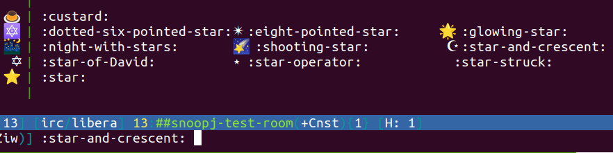

## `slug_complete`

A [weechat](https://weechat.org/) plugin for expanding
[CLDR](https://cldr.unicode.org/) short names, as well as user defined mappings

The `annotations.json` included in this repository are the CLDR annotations for
English, as published by
[`cldr-json`](https://github.com/unicode-org/cldr-json/blob/main/cldr-json/cldr-annotations-full/annotations/en/annotations.json),
but the plugin should probably work with annotations for other languages.
